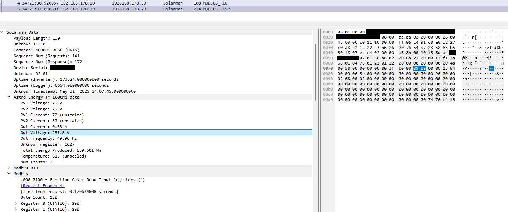

# Solarman protocol dissector for Wireshark

Debug your Solarman PV inverter's communication with Wireshark!

It decodes both the cloud data upload and the Modbus interface.

I've only tested it with my Astro Energy TM-L800Mi, but at least the Modbus part should work with all Inverters using the Solarman app as it's just Modbus with a bit of encapsulation.
